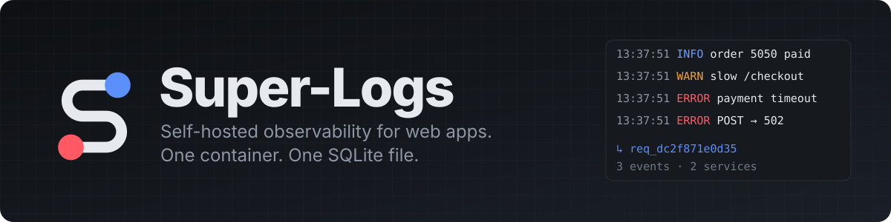
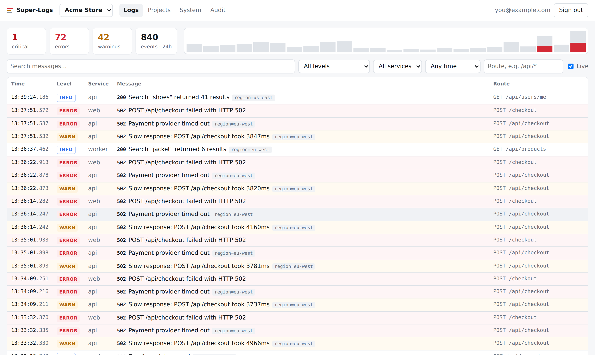
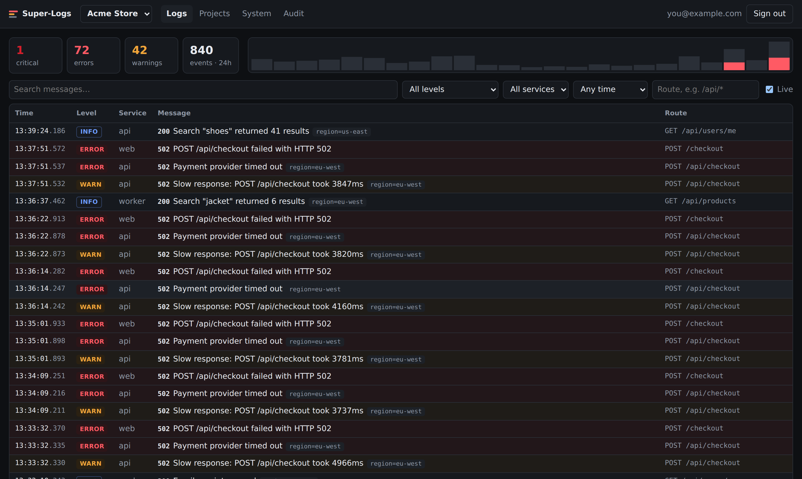
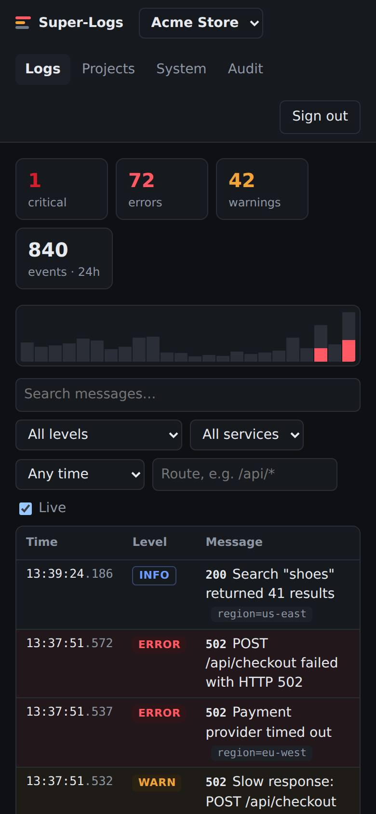
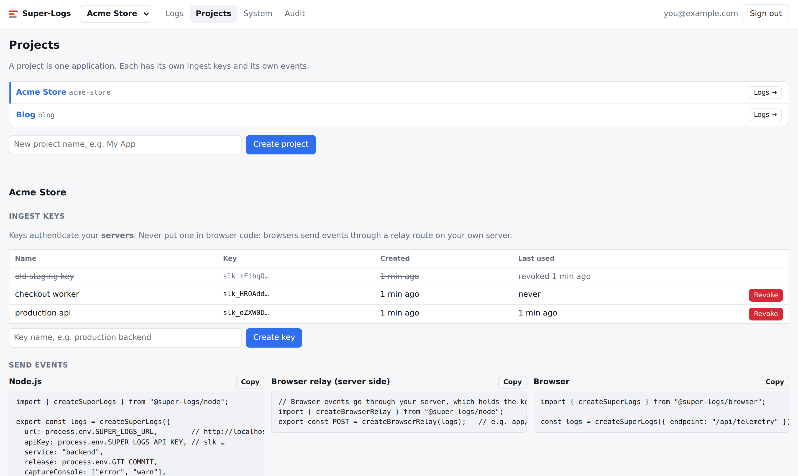
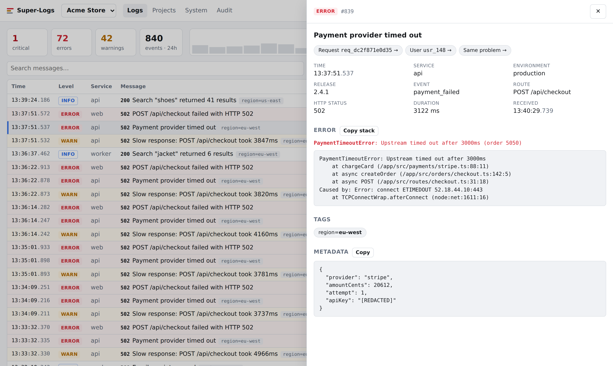
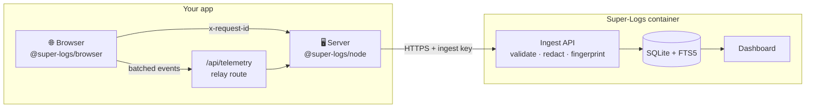
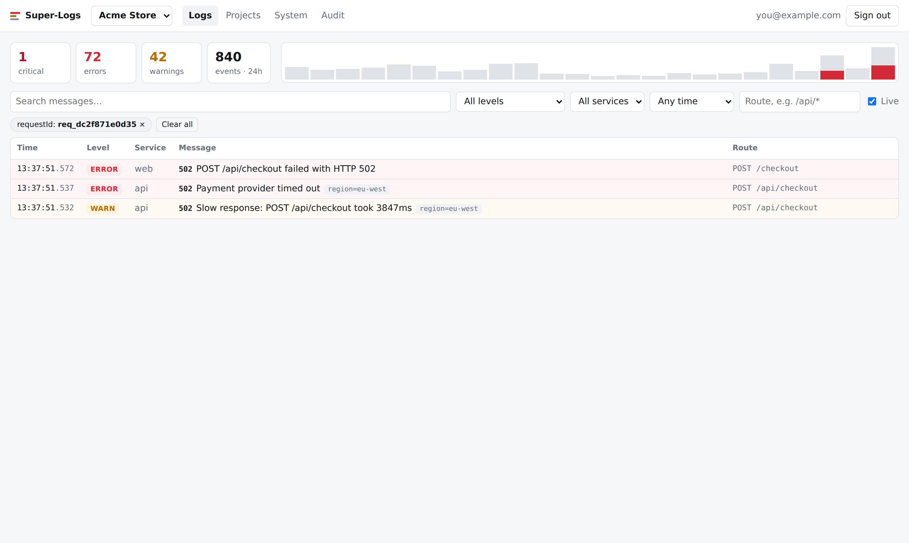

<p align="center">
  
</p>

<p align="center">
  <b>Your app broke. Super-Logs tells you what happened, where, and to whom.</b><br>
  Structured logs from your servers <i>and</i> your users' browsers, joined by request id,<br>
  in a small dashboard you host yourself.
</p>

<p align="center">
  
  
  
  
  
  
</p>

<p align="center">
  <a href="#-quick-start">Quick start</a> ·
  <a href="#-connect-your-app">Connect your app</a> ·
  <a href="#%EF%B8%8F-configuration">Configuration</a> ·
  <a href="#-privacy--security">Privacy & security</a> ·
  <a href="#%EF%B8%8F-roadmap">Roadmap</a>
</p>

---

<p align="center">
  
</p>

## 🤔 Why Super-Logs?

A user writes *"checkout doesn't work"*. You now need to know:

- **What happened?** The exact error, with its stack trace and its cause.
- **Where?** Which service, route and release.
- **To whom?** Which user and session.
- **What else happened in that same request?** Across the browser *and* the server.

SaaS tools answer this well, but they get expensive, and they keep your users' data on someone else's servers. Enterprise stacks answer it too, but they need a cluster to run. **Super-Logs is the small version:** one container you run next to your app, built for a single box.

| | |
|---|---|
| 🪶 **Tiny** | One Node process, one SQLite file, about 90 MB of RAM, 4 production dependencies. |
| 🔗 **Correlated** | The browser SDK adds an `x-request-id` header to your own requests, and the server SDK picks it up. The browser's *"request failed"* and the server's stack trace land side by side. |
| 🛡️ **Never hurts your app** | Logging calls never block and never throw. If Super-Logs is down, your app doesn't notice. |
| 🔒 **Private by default** | Passwords, tokens, cookies, API keys and card numbers are removed *before* they leave your app, and again on arrival. |
| 🏠 **Yours** | Self-hosted, open source, no telemetry, no account anywhere. |

<details>
<summary><b>📸 More screenshots</b>: dark mode, phone, projects & keys</summary>
<br>
<table>
<tr>
<td width="68%"></td>
<td width="32%"></td>
</tr>
<tr>
<td colspan="2"></td>
</tr>
</table>
</details>

## ✨ What you get

<table>
<tr>
<td width="50%" valign="top">

**📥 Ingestion API**
- `POST /api/ingest` with structured JSON events
- Per-project API keys, stored only as hashes, and revocable
- Per-key rate limits and payload limits
- Each event is validated separately, so one bad event doesn't reject its batch

**🧰 SDKs** (MIT)
- [`@super-logs/node`](packages/node): batching, request correlation, `console.error` capture, crash reports that survive the crash
- [`@super-logs/browser`](packages/browser): uncaught errors, failed or slow `fetch` calls, a React error boundary

</td>
<td width="50%" valign="top">

**📊 Dashboard**
- Live stream with error/warning counters and an hourly chart
- Filters for level, service, environment, route, request, session, user, tag and time
- Full-text search
- Event details with **same request / same session / same problem** buttons
- Projects and keys, audit log, system health, dark mode, works on phones

**🧹 Housekeeping**
- Retention: old events are deleted automatically
- Error fingerprints, ready for incident grouping

</td>
</tr>
</table>

<p align="center">
  
  <br><sub>One click on an event shows its stack trace, its cause chain, and one-click pivots to everything else in the same request. Note the <code>apiKey</code>, redacted before it was stored.</sub>
</p>

## 🧠 How it works



1. The **browser** reports uncaught errors and failed requests. It sends them to a route on **your own server**, never straight to Super-Logs, so the browser never needs a key.
2. Your **server** adds what only it knows (the signed-in user, the environment) and sends everything in batches with its ingest key.
3. **Super-Logs** validates, redacts, fingerprints and stores each event. The dashboard shows it within seconds.

<p align="center">
  
  <br><sub><b>One request, three events, two services.</b> The browser's failed POST, the server's payment timeout, and the slow-response warning, found with one click.</sub>
</p>

## 🚀 Quick start

You need **Docker** with Compose.

```bash
git clone https://github.com/The-Onion-Team/Super-Logs.git
cd Super-Logs
cp .env.example .env
```

Edit `.env`:

```bash
SUPER_LOGS_PUBLIC_URL=http://localhost:3400   # the URL you open the dashboard at
SUPER_LOGS_ADMIN_EMAIL=you@example.com
SUPER_LOGS_ADMIN_PASSWORD=pick-something-12-chars-or-more
```

Start it:

```bash
docker compose up -d --build
docker compose ps          # wait for "healthy"
```

Open **http://localhost:3400**, sign in, and choose your real password. The one in `.env` only works for the first sign-in.

> [!TIP]
> Use `http://` in `SUPER_LOGS_PUBLIC_URL` for a local test and `https://` in production. With `https://` the session cookie is marked Secure, so a browser on plain `http` drops it and sign-in fails.

### Send your first event

In the dashboard, go to **Projects**, create a project, then create a key and copy it (it's shown only once). Then:

```bash
curl -X POST http://localhost:3400/api/ingest \
  -H "Authorization: Bearer slk_your_key_here" \
  -H "Content-Type: application/json" \
  -d '{"events":[{"level":"error","message":"Hello, Super-Logs 👋","service":"shell"}]}'
```

```json
{ "accepted": 1, "rejected": 0 }
```

It's already on the Logs page.

### Stop or reset

```bash
docker compose down        # stop (data is kept in the volume)
docker compose down -v     # stop and delete all data
```

## 🔌 Connect your app

> The SDKs aren't on npm yet. Until they are, build them from this repo with `npm install && npm run pack:sdks` and install the tarballs from `dist/sdks/`:
> `npm install ./super-logs-node-0.1.0.tgz ./super-logs-browser-0.1.0.tgz`

### Node.js server

```ts
import { createSuperLogs } from "@super-logs/node";

export const logs = createSuperLogs({
  url: process.env.SUPER_LOGS_URL,          // no URL or key → silent no-op
  apiKey: process.env.SUPER_LOGS_API_KEY,
  service: "api",
  release: process.env.GIT_COMMIT,
  captureConsole: ["error", "warn"],         // your existing console calls are captured too
});

logs.info("Order paid", { orderId });
logs.error("Payment failed", { error, provider: "stripe" });   // stack + cause chain included
```

**Correlate every request.** This works with plain `node:http`, Express, a Next.js custom server and others:

```ts
http.createServer((req, res) =>
  logs.runWithRequest(req, res, () => app(req, res)),
);
```

Every log line written during that request carries its request id. 5xx and slow responses are logged automatically. When you know the user, call `logs.setContext({ userId })`.

<details>
<summary><b>Express</b></summary>

```ts
app.use((req, res, next) => logs.runWithRequest(req, res, next));
app.use((err, req, res, next) => {
  logs.captureException(err);
  next(err);
});
```
</details>

<details>
<summary><b>Next.js (App Router)</b></summary>

```ts
// src/instrumentation.ts: errors from pages, Server Actions and route handlers
import type { Instrumentation } from "next";

export const onRequestError: Instrumentation.onRequestError = async (error, request, context) => {
  if (process.env.NEXT_RUNTIME === "nodejs") {
    const { logs } = await import("@/lib/logs");
    logs.captureException(error, { route: context.routePath, method: request.method });
  }
};
```
</details>

<details>
<summary><b>Background jobs</b></summary>

```ts
await logs.withContext({ tags: { job: "nightly-sync" } }, async () => {
  // everything logged here is tagged job=nightly-sync
});
```
</details>

### Browser

The browser never holds an ingest key. Add a small **relay route** to your server:

```ts
// e.g. Next.js: app/api/telemetry/route.ts
import { createBrowserRelay } from "@super-logs/node";
import { logs } from "@/lib/logs";

export const POST = createBrowserRelay(logs, {
  // who the user is comes from YOUR session, never from the page
  enrich: async (request) => ({ userId: await currentUserId(request) }),
});
```

Then, in the browser:

```ts
import { createSuperLogs } from "@super-logs/browser";

const logs = createSuperLogs({ endpoint: "/api/telemetry", release: "2.4.1" });
```

With that one call you get uncaught errors, unhandled rejections, failed or slow `fetch` calls, and an `x-request-id` on every same-origin request. For React render errors:

```tsx
import { SuperLogsErrorBoundary } from "@super-logs/browser/react";

<SuperLogsErrorBoundary fallback={<p>Something went wrong.</p>}>
  <App />
</SuperLogsErrorBoundary>
```

Full options: [`@super-logs/node`](packages/node/README.md) · [`@super-logs/browser`](packages/browser/README.md)

### Any other language

It's just HTTP:

```http
POST /api/ingest
Authorization: Bearer slk_…
Content-Type: application/json

{ "events": [ { "level": "error", "message": "…" } ] }
```

## 📦 Event format

Only `level` and `message` are required. Everything else is optional, and filterable.

```jsonc
{
  "timestamp": "2026-09-17T10:30:00.000Z",   // defaults to receive time
  "level": "error",                          // debug | info | warning | error | critical
  "message": "Payment provider timed out",
  "event": "payment_failed",                 // stable machine name
  "service": "api",
  "environment": "production",
  "release": "2.4.1",
  "requestId": "req_dc2f871e0d35",           // joins browser + server events
  "sessionId": "sess_32e4d3c8ef1d",
  "userId": "usr_148",                       // an internal id, never an email
  "route": "/api/checkout",                  // query strings are removed
  "method": "POST",
  "httpStatus": 502,
  "durationMs": 3122,
  "error": { "name": "PaymentTimeoutError", "message": "…", "stack": "…" },
  "tags": { "region": "eu-west" },           // short labels you can filter by
  "metadata": { "provider": "stripe" }       // anything else
}
```

| Limit | Value |
|---|---|
| Events per request | 100 |
| Request size | 512 KB |
| Message | 2,000 chars |
| Stack trace | 16,000 chars |
| Metadata | 16 KB |
| Tags | 20 |

Every warning, error and critical event gets a **fingerprint**, built from the service, error type, message pattern and top stack frames. That's how the **Same problem** button finds every occurrence, even when ids and numbers differ.

## ⚙️ Configuration

Everything is set through environment variables, and every one is documented in [`.env.example`](.env.example).

| Variable | Default | What it does |
|---|---|---|
| `SUPER_LOGS_PUBLIC_URL` | `http://localhost:3000` | The dashboard's URL. `https://` turns on Secure cookies and HSTS. Requests from any other origin are rejected. |
| `SUPER_LOGS_ADMIN_EMAIL` | — | First administrator. Only used when no user exists yet. |
| `SUPER_LOGS_ADMIN_PASSWORD` | — | That administrator's first password (12+ chars). It must be changed at first sign-in. |
| `SUPER_LOGS_RETENTION_DAYS` | `14` | Events older than this are deleted (checked hourly). |
| `SUPER_LOGS_SESSION_TTL_HOURS` | `168` | How long an unused dashboard session stays valid. |
| `SUPER_LOGS_INGEST_EVENTS_PER_MINUTE` | `6000` | Rate limit per ingest key. |
| `SUPER_LOGS_TRUST_PROXY` | `true` | Read the client IP from `CF-Connecting-IP` / `X-Forwarded-For`. The IP is used for rate limits only. |
| `SUPER_LOGS_LOG_LEVEL` | `info` | Verbosity of Super-Logs' own logs. |
| `SUPER_LOGS_DATA_DIR` | `/data` in Docker | Where the database lives. |

## 🌍 Running it in production

The container listens on `127.0.0.1:3400` only. Put your TLS in front of it.

<details open>
<summary><b>Cloudflare Tunnel</b></summary>

Add a public hostname to your tunnel:

| Public hostname | Service |
|---|---|
| `logs.example.com` | `http://127.0.0.1:3400` |

Then set `SUPER_LOGS_PUBLIC_URL=https://logs.example.com` and restart.
</details>

<details>
<summary><b>Caddy</b></summary>

```caddy
logs.example.com {
  reverse_proxy 127.0.0.1:3400
}
```
</details>

<details>
<summary><b>Apps on the same machine</b></summary>

Super-Logs' compose file creates a Docker network called `super-logs`. Containers in other compose projects can join it and reach the server at `http://super-logs:3000`, without leaving the machine:

```yaml
services:
  my-app:
    networks: [default, super-logs]
networks:
  super-logs:
    external: true
```
</details>

**Backups.** Everything is in one volume (`super-logs-data`). To copy the database safely while it runs:

```bash
docker compose exec super-logs node --disable-warning=ExperimentalWarning -e '
  require("node:fs").rmSync("/data/backup.db", { force: true });
  new (require("node:sqlite").DatabaseSync)("/data/super-logs.db").prepare("VACUUM INTO ?").run("/data/backup.db");'
docker compose cp super-logs:/data/backup.db ./super-logs-backup.db
```

## 🔐 Privacy & security

**Your users' data**
- Sensitive keys (`password`, `token`, `secret`, `authorization`, `cookie`, `apiKey`, card fields, …) and credential-shaped values (Bearer tokens, JWTs, card numbers, `?token=` in URLs) are **redacted in the SDK** and **again on arrival**.
- Routes are stored without query strings.
- Client IP addresses are used only for rate limiting and are **never stored**.
- User ids come from **your server**, never from the browser.
- Old events are deleted automatically.

**Your dashboard**
- Passwords are hashed with scrypt. Session tokens and API keys are stored only as SHA-256 hashes.
- Cookies are `HttpOnly` + `SameSite=Strict` (+ `Secure` over HTTPS).
- Every change is checked for cross-site requests (custom header + `Origin` check).
- Sign-in is locked after repeated failures.
- Strict Content Security Policy, `X-Frame-Options: DENY`, HSTS.
- An **audit log** records every sign-in and administrative change.

Found a vulnerability? Please report it privately through [GitHub security advisories](https://github.com/The-Onion-Team/Super-Logs/security/advisories/new) instead of opening a public issue.

## 🛠️ Development

Requires **Node ≥ 22.13** (24 recommended).

```bash
npm install
npm run build          # shared → SDKs → dashboard → server
npm test               # 48 tests: shared, SDKs, server API
npm run typecheck

npm run dev            # API on :3000 (reads .env)
npm run dev:dashboard  # dashboard with hot reload on :5173
npm run pack:sdks      # SDK tarballs in dist/sdks/
```

```text
apps/
  server/       Hono API · ingestion · housekeeping · node:sqlite     (AGPL-3.0)
  dashboard/    React dashboard, served by the server                 (AGPL-3.0)
packages/
  shared/       event model · redaction · fingerprints, no deps       (MIT)
  node/         @super-logs/node                                      (MIT)
  browser/      @super-logs/browser (+ /react)                        (MIT)
docs/img/       screenshots
IDEA.md         the full product vision
```

**Design rules** that every change should keep:
1. **Never hurt the host app.** SDK calls are synchronous pushes into a bounded queue. Delivery has timeouts and backoff, and when the queue is full the oldest events are dropped.
2. **Privacy first.** When in doubt, redact.
3. **Stay small.** A new dependency or a new process needs a very good reason.

## 🗺️ Roadmap

- [x] **Phase 1 · Logging core**: ingestion, SDKs, storage, dashboard, auth, retention
- [ ] **Phase 2 · Incidents & alerts**: group errors into incidents, health checks, alert rules, **Telegram** notifications with deduplication and cooldowns
- [ ] **Phase 3 · AI analysis**: runs automatically on major incidents with a small open model (e.g. Qwen or Kimi) through any OpenAI-compatible endpoint, always keeping *observed evidence* separate from *inference*
- [ ] **Phase 4 · User diagnostics**: a *"Report a problem"* flow that asks for consent, with a screenshot, the page trail and a link to the server events
- [ ] **Phase 5 · Open-source hardening**: SDKs on npm, more examples, a security review

The full vision is in [`IDEA.md`](IDEA.md).

## 💚 Free and self-hosted, for good

The core of Super-Logs (everything in this repository) is free and self-hostable, and it will stay that way. Optional paid extras may come later, and they will be built on top of the open core, never by removing features from it.

## 📄 License

- **Server and dashboard** (`apps/`): [GNU AGPL-3.0](LICENSE). Use it, change it and self-host it freely. If you offer a modified version to others as a network service, you must share your changes.
- **SDKs and shared package** (`packages/`): [MIT](packages/node/LICENSE). Put them in any app, open or closed source, without any obligation.

---

<p align="center">
  <sub>Made by <a href="https://github.com/The-Onion-Team">The Onion Team</a>. First battle-tested on <a href="https://f1.bortolaso.eu">Fanta F1 Dynasty</a>.</sub>
</p>
